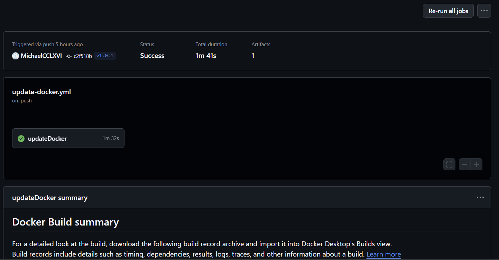
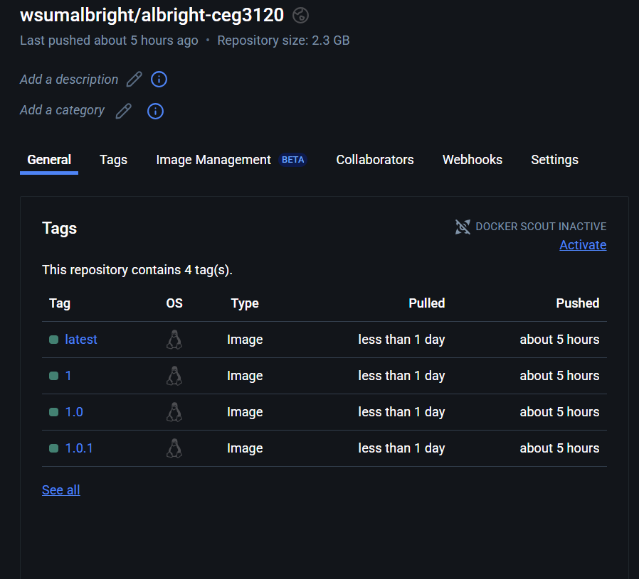

# Project 5
Michael Albright

## Project Overview
**This Project Involves**:
- Implementing semantic versioning with GitHub Actions and `git tag`
- Using `webhook`s to keep production up to date

**Tools involved**:
- Ubuntu & Docker
- GitHub Actions
- webhook

## Tagging
* Using the `git tag` command to create tags
* To see any existing tags in the repository:
  * `git tag`
* To create a new tag (v1.0.1 for example):
  * `git tag -a v1.0.1`
* To push a tag to a repository
  * `git push origin v1.0.1`

### GitHub Actions: Semantic Versioning
* The [workflow file](.github/workflows/update-docker.yml) builds the image from the Dockerfile in the root repository and pushes it to the Docker repository with tags.
* The workflow happens after either:
  * A push to the `main` branch
  * A push to a new tag
* Steps:
  * Docker metadata
    * Gets data from Docker and tags
    * Sets up new tags for the next docker push
  * Checkout & Set up docker buildx
    * Both of these steps set up necessary components for other steps.
  * Login to Dockerhub
    * Logs in to Dockerhub to access the repository
    * Two secrets are used here to login: `DOCKER_USERNAME` and `DOCKER TOKEN`
    * Secrets may vary by person
  * Build & push
    * First, this step builds an image from the Dockerfile and also tags it with the repository name (and latest)
      * This part also uses two secrets: `DOCKER_USERNAME` and `DOCKER_REPO`
    * Second, the created image pushes the new image to the docker repository, replacing the current image with the name and tag

Evidence the workflows worked:

These images were taken at roughly the same time.

## Continuous Deployment
This part involves using `webhook`s and an EC2 Instance is necessary.

### Instance Details
* AMI:              `Ubuntu-24.04`
* Instance type:    `t2.medium`
* Volume size:      `30 GiB`
* Security Group Configuration:
  * Inbound:
    * `0.0.0.0/0`; 4200     to view the site from port 4200
    * `0.0.0.0/0`; 80
    * `130.108.0.0/16`; 22
    * `My home IP`; 22
  * Outbound:
    * `0.0.0.0/0`; All ports

### Docker on Ubuntu
* Install Docker with `sudo apt install docker.io`
* Get the desired image with `docker pull [image]`
* To run a container with the image, use `docker run [-it/-d] -p 4200:4200 [image] (bash)`
  * `-it` enables interaction with the container after it is created
    * `bash` is included in the command
  * `-d` runs the container in the background, detaching it
    * `bash` is not included in the command
* To validate:
  * From container side:
    * Attaching to container should tell if angular is running
  * From host side:
    * `curl localhost:4200`
  * From external source:
    * In a url bar: `http://[instance ip]:4200`
* If a new image version is available:
  * Stop current container with `docker stop [containerid]`
  * Remove container with `docker rm [containerid]`
  * Pull newest version of image with `docker pull [image]:latest`
  * Run a new container with the newest image version
  * Verify once again

### bash: Container Refreshing
* The [bash script](deployment/run-deploy.sh) is question will:
  * Kill and remove any containers using the Dockerfile image
  * Pull the latest version of the Dockerfile image
  * Run a new container with the latest version of the image
* To test the script works:
  * `bash run-deploy.sh` from the `deployment` directory
    * or just replace `run-deploy.sh` with the path to that file
  * `docker ps` should display a newly created running container

### Webhook
* Install `webhook` to ubuntu with `sudo apt install webhook`
* Verify installation by finding the `webhook command`
  * `which webhook`
* The [definition file](deployment/hooks.json) gives a hook
  * an id (`redeploy` in this case)
  * a command to execute (the bash script in this case)
  * a working directory for the command (`/usr/bin/webhook`) in this case
* Run a hook with the command `webhook -hooks [definition file] -verbose` (`-verbose` to see an output)
* To verify the hook:
  * Connect to the instance in another tab and type `curl localhost:9000/hooks/redeploy`
    * `redeploy` is the instance id in this case
  * The second instance connection may show nothing, but check the first tab
  * The first tab should be mention a connection has been made to the hook

### Payloads
* I have chosen Docker as the payload sender
  * Since any change made to an image reaches Docker only
* Enable a webhook in Docker through the `webhooks` tab in the image repository in hub.docker.com
* The webhook kicks off a workflow when an image is pushed to the repository
* Verify the success by checking the webhook in the Docker hub.

### Sources:
* https://docs.docker.com/build/ci/github-actions/manage-tags-labels/
* https://stackoverflow.com/questions/5195859/how-do-you-push-a-tag-to-a-remote-repository-using-git
