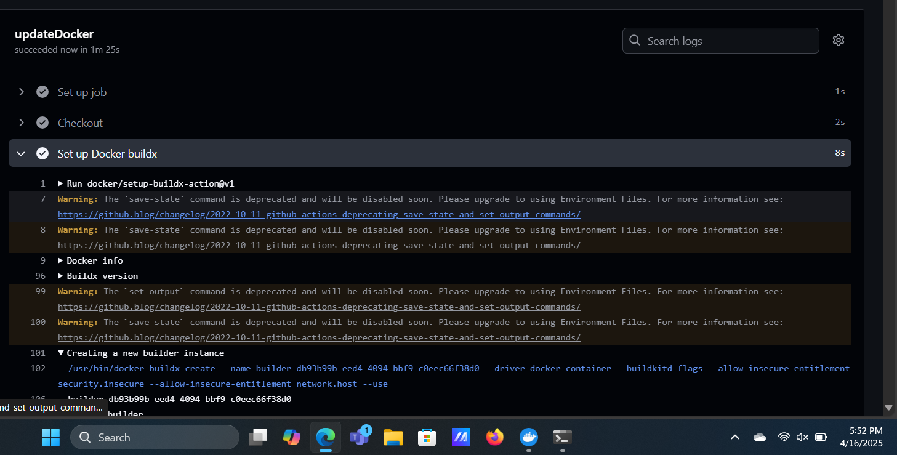
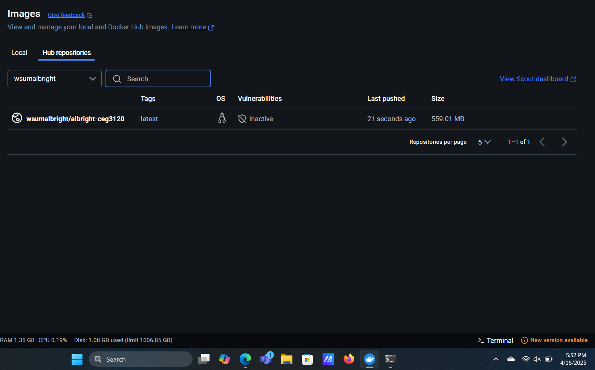
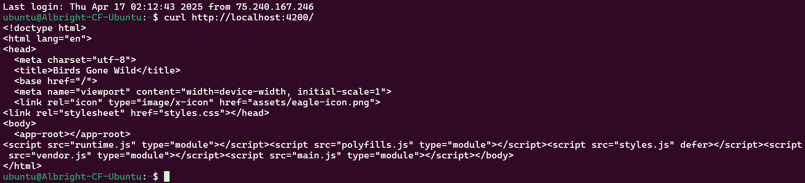

# Project 4
Michael Albright


## Project Overview

**This project involves**:
- running an application using a container with Docker
- automating the pipeline with Github Actions

**Tools used**:
- Ubuntu & Docker
- nginx
- angular

**Diagram of this project**:
```mermaid
flowchart LR
    A[Developer] -->|Direct access| B[Dockerfile]
    B --> C[GitHub] 
    C -->|actions/checkout@v2| D[GitHub Action]
    D -->|docker/login-action@v1| E[Dockerhub]
    B --> F(docker/build-push-action@v2)
    F --> D
    F --> E
```

## Running the Project
Using Windows 11 or Ubuntu 22.04, installing docker is easy.
For Windows 11:
* Go to [This link](https://docs.docker.com/desktop/setup/install/windows-install/) and click the `Docker Desktop for Windows - x86_64` button
* When finished downloading, open `Docker Desktop Installer.exe` and configure.
* When prompted, select **Use WSL2 instead of HyperV**
* Continue to follow instructions to install, then click `Close` when completed.

For Ubuntu/WSL2:
* Use the command `sudo apt install docker`

### Running the container manually
Using docker with Ubuntu:
* Use command `docker pull node:18-bullseye` to get the appropriate image
* Then, use the command `docker run -it -p 4200:4200 node:18-bullseye bash` to create the container, start it, and attach to it with `bash`
  * The `-p 4200:4200` option is to properly open the container to the desired port.
  * May need to restart it after exiting the container configuration.
* Get the compressed `angular-bird.zip` file with the command `wget https://github.com/pattonsgirl/CEG3120/raw/refs/heads/main/Projects/Project4/angular-bird.zip`
* Unzip it and relocate the files with the command `unzip angular-bird.zip -d angular-site`
* Change directory with `cd angular-site/wsu-hw-ng-main/`
* Use command `npm install -g @angular/cli`, then if necessary just `npm install`
* Start the server with the command `ng serve --host 0.0.0.0` to open it to all IP addresses.
  * There will be no command line to enter commands into once the server is running.
  * Confirm the server is running by connecting to the instance in another ubuntu window and use the command `curl 0.0.0.0`.

### Building an image with a Dockerfile
Once again using docker with Ubuntu, multiple different lines are needed in the `Dockerfile` to run Angular, including:
* `FROM`, followed by the base image, in this case: `node:18-bullseye`
* `COPY`, followed by the directory to copy from (in your system), followed by the directory to copy to (in the image filesystem)
  * NOTE: The `COPY` line copiess the source directory's CONTENTS, not the directory itself.
* `WORKDIR`, followed by the directory to run commands from in the image filesystem.
  * NOTE: Best to put this line after the `COPY` line.
* `RUN`, followed by a command to run in the image
  * NOTE: Multiple `RUN` lines are allowed, each will run one after another.
* `CMD`, followed by the command to run when a container runs this image.
  * NOTE: If multiple `CMD` lines exist, only the last one will run when a container uses this image.
For this part of the project, the `Dockerfile` contains these lines:
```
FROM node:18-bullseye

COPY angular-site .

WORKDIR /wsu-hw-ng-main

RUN npm install -g @angular/cli

RUN npm install

CMD ng serve --host 0.0.0.0
```
To validate these lines, perform the same steps as in the previous section:
  * There will be no command line to enter commands into once the server is running.
  * Confirm the server is running by connecting to the instance in another ubuntu window and use the command `curl 0.0.0.0`.

### Creating a Docker repository
* In your Docker Desktop window, click the nine-dotted icon and click `Docker Hub`
* What should be present is the repositories for the account.
* Click `Create a repository`
* Give it a name, and description if desired, make it visibly public, and then hit `Create`.
* The repository should be created.

### Push Dockerfile image to Dockerhub
This part can get a bit tricky. If the image was named improperly, the `docker` command line will not push properly.  Tofix this:
* `docker logout`
* Change the name of the image with the command `docker tag <imageId> username/dockerrepo`
* Log back in using a Personal Access Token instead of a password
  * Log in to docker through a web explorer
  * Go to `Account Settings` under the user icon, then to the `Personal access tokens` tab.
  * Create a Personal access token with the proper permissions, then follow given instructions.
* Push the image to the repo with the command `docker push username/dockerrepo`

## Github Actions
With Github Actions, the image created by the Dockerfile can be updated after every `git push`.  To utilize workflows securely, the secrets in the git repository will be made.

### Creating secrets
To create secrets in the GitHub repo:
* Go to the repository's `Settings` tab
* Click on the `Secrets and variables` section on the right
  * go to `actions`
* There is a section called `Repository secrets`, click on `New repository secret` to make a new one.
  * Give it a name, e.g. `DOCKER_USERNAME`, depending on what value will be stored in it.

### Workflow
The [workflow file](.github/workflows/update-docker.yml) builds an image from the Dockerfile and pushes the image to the Docker repository.  This happens after each push to the git repository.  
For each step in the workflow's job section:
* Checkout & Set up docker buildx
  * Both of these steps set up necessary components for other steps.
* Login to Dockerhub
  * Logs in to Dockerhub to access the repository
  * Two secrets are used here to login: `DOCKER_USERNAME` and `DOCKER TOKEN`
* Build & push
  * First, this step builds an image from the Dockerfile and also tags it with the repository name (and latest)
    * This part also uses two secrets: `DOCKER_USERNAME` and `DOCKER_REPO`
  * Second, the created image pushes the new image to the docker repository, replacing the current image with the name and tag

### Does it work?
To verify if the actions actually pushed the image to the repo AND if the image still works:
* Check for a change in the image repository in the Docker desktop application
* Pull and run the image
  * `docker pull username/repository`
  * `docker run -p 4200:4200 repository`
* Use `curl` in the instance in another window
  * `curl http://localhost:4200/
* The contents of angular's `index.html` file should display
Evidence:





### Sources:
* https://stackoverflow.com/questions/36663742/docker-unauthorized-authentication-required-upon-push-with-successful-login/42300879#42300879
* https://github.com/pattonsgirl/CEG3120/blob/main/Projects/Project4/sample-workflows/docker-workflow-v2.yml
